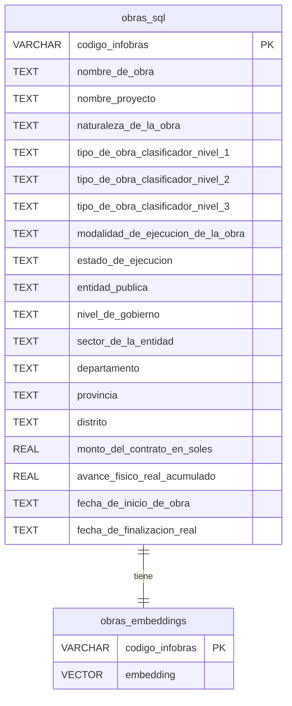

# BUSCADOR SEMANTICO DE OBRAS PÚBLICAS
*Arquitectura Híbrida Relacional-Vectorial en PostgreSQL para la consulta avanzada y seguimiento de Obras Públicas en Arequipa* 
<!--
---
Sistema de búsqueda semántica sobre datos de **Infobras** que permite consultar obras públicas mediante lenguaje natural y filtrar resultados por múltiples criterios geográficos y administrativos. -->

---

## Características

- **Búsqueda por lenguaje natural** — Encuentra obras describiendo lo que buscas, sin necesidad de palabras clave exactas.
- **Filtros avanzados** — Filtra por departamento, provincia, distrito, nivel de gobierno, sector, naturaleza, tipo de obra, modalidad y rango de monto.
- **Detalle completo de obra** — Consulta todos los campos de cada registro al hacer clic en un resultado.
- **Interfaz web incluida** — SPA (Single Page App) servida directamente por el backend.
- **Despliegue con Docker** — Todo el stack levanta con un solo comando.

---

## Arquitectura




### Componentes principales

| Componente | Tecnología | Descripción |
|---|---|---|
| Backend API | FastAPI + psycopg2 | Endpoints RESTful, generación de embeddings en tiempo real |
| Base de datos | PostgreSQL 16 + pgvector | Almacena obras y sus vectores; búsqueda por similitud coseno |
| Frontend | HTML / CSS / JS (SPA) | Interfaz de búsqueda y visualización, servida por FastAPI |
| Preprocesamiento | Python + Pandas | Limpia, normaliza y prepara los datos del Excel de Infobras |

---

## Estructura del repositorio

```
IA_TABD/
├── api/
│   ├── main.py              # Aplicación FastAPI (endpoints + lógica de búsqueda)
│   └── templates/
│       └── index.html       # Frontend (SPA)
├── data/
│   ├── DataSet-Obras-Publicas *.xlsx   # Dataset crudo de Infobras
│   ├── data_sql.parquet                # Datos limpios para la BD
│   └── data_procesada.parquet         # Textos para generación de embeddings
├── init/
│   └── 01_schema.sql        # Schema inicial de PostgreSQL
├── preprocesar.py           # Script de preprocesamiento de datos
├── docker-compose.yml
├── .env.example
└── docs/                    # Documentación completa del proyecto
```

---

## Inicio rápido

### Prerrequisitos

- [Docker](https://docs.docker.com/get-docker/) y Docker Compose
- Dataset de Infobras en `data/` (archivo `.xlsx`)

### 1. Clonar el repositorio

```bash
git clone https://github.com/joeCuadros/IA_TABD.git
cd IA_TABD
```

### 2. Configurar variables de entorno

```bash
cp .env.example .env
```

Edita `.env` con tus valores:

```env
POSTGRES_DB=obras
POSTGRES_USER=admin
POSTGRES_PASSWORD=your_password
MODEL_NAME=sentence-transformers/all-MiniLM-L6-v2
```

### 3. Preprocesar los datos

```bash
pip install pandas openpyxl pyarrow
python preprocesar.py
```

Esto genera `data/obras_sql.parquet` y `data/obras_embeddings_colab.parquet`.

> **Nota:** La generación de embeddings vectoriales se realiza en un paso separado (compatible con Google Colab) usando `obras_embeddings_colab.parquet`.

### 4. Levantar el stack

```bash
docker compose up --build
```

La aplicación estará disponible en **http://localhost:8000**.

---

## API Reference

### Búsqueda semántica

```http
POST /search
Content-Type: application/json

{
  "texto": "agua potable en zonas rurales",
  "top": 10,
  "departamento": "Cusco",
  "monto_min": 100000,
  "monto_max": 5000000
}
```

**Parámetros opcionales de filtro:** `departamento`, `provincia`, `distrito`, `nivel_de_gobierno`, `sector_de_la_entidad`, `naturaleza_de_la_obra`, `tipo_de_obra_clasificador_nivel_1`, `tipo_de_obra_clasificador_nivel_2`, `modalidad_de_ejecucion_de_la_obra`, `estado_de_ejecucion`, `monto_min`, `monto_max`.

### Detalle de obra

```http
GET /obras/{codigo_infobras}
```

### Endpoints de filtros (selects dinámicos)

| Endpoint | Parámetro opcional |
|---|---|
| `GET /selects/departamentos` | — |
| `GET /selects/provincias` | `?departamento=` |
| `GET /selects/distritos` | `?provincia=` |
| `GET /selects/niveles-gobierno` | — |
| `GET /selects/sectores` | — |
| `GET /selects/naturalezas` | — |
| `GET /selects/tipos-nivel-1` | — |
| `GET /selects/tipos-nivel-2` | `?nivel1=` |
| `GET /selects/modalidades` | — |
| `GET /selects/estados` | — |

---

## Esquema de base de datos

```
obras_sql              obras_embeddings
─────────────────      ────────────────────────
codigo_infobras (PK) ──► codigo_infobras (PK, FK)
nombre_de_obra          embedding (VECTOR)
naturaleza_de_la_obra
tipo_de_obra_*
modalidad_de_ejecucion
estado_de_ejecucion
entidad_publica
nivel_de_gobierno
sector_de_la_entidad
departamento / provincia / distrito
monto_del_contrato_en_soles
avance_fisico_real_acumulado
fecha_de_inicio / fecha_de_finalizacion
... (otros campos)
```

---

## Preprocesamiento de datos

`preprocesar.py` realiza las siguientes fases sobre el Excel de Infobras:

1. **Carga optimizada** — Lee el `.xlsx` y lo guarda como Parquet para acelerar ejecuciones posteriores.
2. **Normalización de columnas** — Convierte nombres a `snake_case` sin tildes ni caracteres especiales.
3. **Limpieza de strings** — Elimina espacios en blanco extraños en todos los campos de texto.
4. **Construcción del texto para embeddings** — Concatena campos relevantes (nombre, tipo, naturaleza, ubicación, entidad, estado…) en una sola cadena coherente por obra.
5. **Exportación** — Genera `obras_sql.parquet` (datos para la BD) y `obras_embeddings_colab.parquet` (textos para vectorizar).

---

## Documentación

La documentación completa del proyecto se encuentra en la carpeta [`docs/`](./docs/):

- [Visión General y Arquitectura](./docs/1_ARQUITECTURA.md)
- [Proceso de Preprocesamiento de Datos](./docs/2_PREPROCESAMIENTO.md)
- [API RESTful y Lógica de Backend](./docs/3_LOGICA%20BACKEND.md)
- [Interfaz de Usuario (Frontend)](./docs/4_UI.md)
- [Despliegue y Configuración del Entorno](./docs/5_DEPLOYMENT.md)

---

## Stack tecnológico

- **[FastAPI](https://fastapi.tiangolo.com/)** — Framework web asíncrono para Python
- **[PostgreSQL 16](https://www.postgresql.org/)** + **[pgvector](https://github.com/pgvector/pgvector)** — Base de datos con soporte para búsqueda vectorial
- **[FastEmbed](https://github.com/qdrant/fastembed)** — Generación eficiente de embeddings (`all-MiniLM-L6-v2`)
- **[psycopg2](https://www.psycopg.org/)** — Adaptador PostgreSQL para Python
- **[Pandas](https://pandas.pydata.org/)** — Manipulación y preprocesamiento de datos
- **[Docker Compose](https://docs.docker.com/compose/)** — Orquestación de servicios

---
<!--
## Licencia

Este proyecto es parte de un trabajo académico sobre bases de datos e inteligencia artificial (TABD).-->