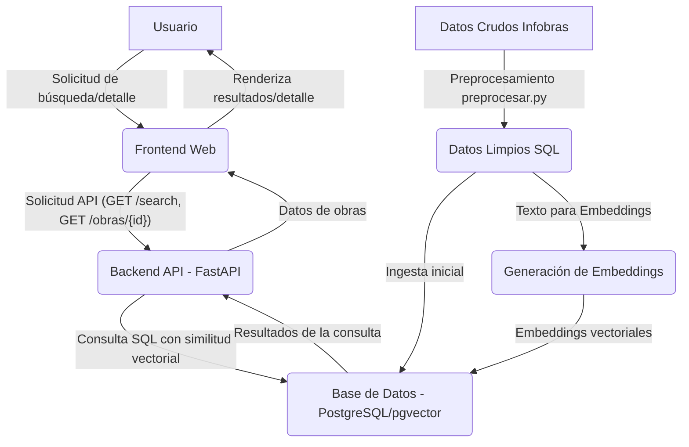
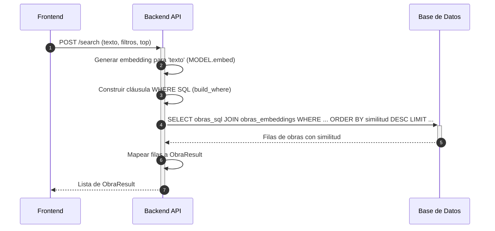
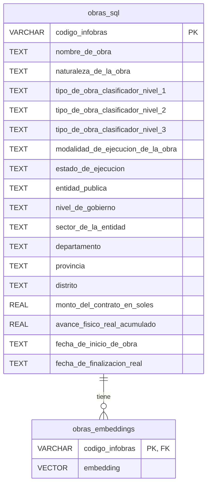

## ARQUITECTURA DEL SISTEMA

### Related Pages

Related topics: [Proceso de Preprocesamiento de Datos](#page-2), [API RESTful y Lógica de Backend](#page-3), [Interfaz de Usuario (Frontend)](#page-4), [Despliegue y Configuración del Entorno](#page-5)

<details>
<summary>Relevant source files</summary>

- [docker-compose.yml](https://github.com/joeCuadros/IA_TABD/blob/main/docker-compose.yml)
- [api/main.py](https://github.com/joeCuadros/IA_TABD/blob/main/api/main.py)
- [preprocesar.py](https://github.com/joeCuadros/IA_TABD/blob/main/preprocesar.py)
- [api/templates/index.html](https://github.com/joeCuadros/IA_TABD/blob/main/api/templates/index.html)
- [init/01_schema.sql](https://github.com/joeCuadros/IA_TABD/blob/main/init/01_schema.sql)
</details>

# VISION GENERAL Y ARQUITECTURA DEL SISTEMA

El proyecto IA_TABD implementa un sistema de búsqueda semántica para obras públicas, utilizando datos de Infobras. Su propósito principal es permitir a los usuarios buscar obras mediante descripciones en lenguaje natural y filtrar los resultados por diversos criterios, proporcionando una interfaz web interactiva. La arquitectura se basa en un backend API desarrollado con FastAPI, una base de datos PostgreSQL con la extensión `pgvector` para manejar embeddings vectoriales, y un frontend web sencillo construido con HTML y JavaScript. Un proceso de preprocesamiento de datos prepara la información para su ingesta y uso en el sistema.

## Arquitectura del Sistema

El sistema se compone de varios módulos interconectados que trabajan en conjunto para ofrecer la funcionalidad de búsqueda semántica. La comunicación principal se da entre el cliente web (frontend), el servidor API y la base de datos. Un paso inicial de preprocesamiento de datos es crucial para preparar la información.


El flujo comienza con el usuario interactuando con el frontend, que envía solicitudes al backend. El backend procesa estas solicitudes, interactúa con la base de datos para obtener la información relevante y devuelve los resultados al frontend para su visualización. El preprocesamiento de datos es un paso previo que alimenta la base de datos.
Sources: [docker-compose.yml:1-25](), [api/main.py:23-24](), [preprocesar.py:76-85]()

## Backend API (FastAPI)

El backend es una aplicación FastAPI que actúa como el cerebro del sistema, manejando la lógica de negocio, la interacción con la base de datos y la exposición de los datos a través de una API RESTful. También sirve el archivo HTML del frontend.

### Componentes principales del Backend

*   **Aplicación FastAPI:** La instancia principal de la aplicación (`app = FastAPI(...)`).
*   **Gestión del Ciclo de Vida (`lifespan`):** Un `asynccontextmanager` que se encarga de cargar el modelo de embeddings (`TextEmbedding`) al inicio de la aplicación y gestiona su cierre.
    Sources: [api/main.py:2-46]()
    ```python
    # api/main.py
    @asynccontextmanager
    async def lifespan(app: FastAPI):
        global MODEL
        print(f"Cargando modelo {MODEL_NAME} con FastEmbed...")
        MODEL = TextEmbedding(MODEL_NAME)
        print("Modelo listo.")
        yield
        print("Shutdown.")
    ```
*   **Conexión a Base de Datos:** La función `get_conn()` establece una conexión a PostgreSQL utilizando `psycopg2` y registra la extensión `pgvector` para habilitar el manejo de tipos de datos vectoriales.
    Sources: [api/main.py:27-33]()
    ```python
    # api/main.py
    def get_conn():
        conn = psycopg2.connect(**CONN_PARAMS)
        register_vector(conn)
        return conn
    ```
*   **Middleware CORS:** Permite solicitudes de origen cruzado, configurado para aceptar cualquier origen en desarrollo (`allow_origins=["*"]`).
    Sources: [api/main.py:48-53]()
*   **Esquemas de Datos (Pydantic):** Define la estructura de los datos para las solicitudes y respuestas API.
    *   `BusquedaRequest`: Define los parámetros para la búsqueda semántica, incluyendo el texto de búsqueda y filtros opcionales.
    *   `ObraResult`: Define la estructura de los resultados de una obra retornados por la API de búsqueda.
    Sources: [api/main.py:57-89]()

### Endpoints API

La API expone varios endpoints para interactuar con el sistema:

| Endpoint                               | Método | Descripción                                                               | Parámetros de Consulta / Cuerpo de Solicitud | Respuesta                                       |
| :------------------------------------- | :----- | :------------------------------------------------------------------------ | :------------------------------------------- | :---------------------------------------------- |
| `/`                                    | `GET`  | Sirve el archivo HTML del frontend (`index.html`).                        | N/A                                          | `HTMLResponse`                                  |
| `/search`                              | `POST` | Realiza una búsqueda semántica de obras.                                  | `BusquedaRequest` (JSON)                     | Lista de `ObraResult`                           |
| `/obras/{codigo_infobras}`             | `GET`  | Retorna todos los detalles de una obra específica por su código Infobras. | `codigo_infobras` (path)                     | Diccionario con todos los campos de la obra     |
| `/selects/departamentos`               | `GET`  | Retorna una lista de departamentos únicos.                                | N/A                                          | Lista de strings                                |
| `/selects/provincias`                  | `GET`  | Retorna una lista de provincias únicas, opcionalmente filtradas por departamento. | `departamento` (query, opcional)             | Lista de strings                                |
| `/selects/distritos`                   | `GET`  | Retorna una lista de distritos únicos, opcionalmente filtrados por provincia. | `provincia` (query, opcional)                | Lista de strings                                |
| `/selects/niveles-gobierno`            | `GET`  | Retorna una lista de niveles de gobierno únicos.                          | N/A                                          | Lista de strings                                |
| `/selects/sectores`                    | `GET`  | Retorna una lista de sectores únicos.                                     | N/A                                          | Lista de strings                                |
| `/selects/naturalezas`                 | `GET`  | Retorna una lista de naturalezas de obra únicas.                          | N/A                                          | Lista de strings                                |
| `/selects/tipos-nivel-1`               | `GET`  | Retorna una lista de tipos de obra nivel 1 únicos.                        | N/A                                          | Lista de strings                                |
| `/selects/tipos-nivel-2`               | `GET`  | Retorna una lista de tipos de obra nivel 2, opcionalmente filtrados por nivel 1. | `nivel1` (query, opcional)                   | Lista de strings                                |
| `/selects/modalidades`                 | `GET`  | Retorna una lista de modalidades de ejecución únicas.                     | N/A                                          | Lista de strings                                |
| `/selects/estados`                     | `GET`  | Retorna una lista de estados de ejecución únicos.                         | N/A                                          | Lista de strings                                |

Sources: [api/main.py:92-205]()

### Lógica de búsqueda Semántica

La búsqueda semántica se implementa en el endpoint `/search`.

1.  El frontend envía el texto de búsqueda y los filtros al endpoint `/search`.
2.  El backend utiliza el modelo `TextEmbedding` para convertir el texto de búsqueda en un vector de embedding.
3.  Se construye una cláusula `WHERE` dinámica (`build_where`) a partir de los filtros proporcionados.
4.  Se ejecuta una consulta SQL que une las tablas `obras_sql` y `obras_embeddings`, utilizando el operador `<=>` de `pgvector` para calcular la distancia coseno entre el embedding de la consulta y los embeddings almacenados, ordenando los resultados por similitud.
5.  Los resultados de la base de datos se mapean a objetos `ObraResult` y se devuelven al frontend.
Sources: [api/main.py:92-149]()

## Base de Datos (PostgreSQL con pgvector)

La base de datos PostgreSQL es el repositorio central de toda la información de las obras públicas. Utiliza la extensión `pgvector` para almacenar y consultar embeddings vectoriales, lo que es fundamental para la búsqueda semántica.

### Configuración y Conexión

La configuración de la conexión a la base de datos se define a través de variables de entorno (POSTGRES\_HOST, POSTGRES\_PORT, etc.), lo que permite una fácil adaptación a diferentes entornos.
Sources: [api/main.py:23-28]()
```yaml
# docker-compose.yml
services:
  db:
    image: ankane/pgvector
    ports:
      - "5432:5432"
    environment:
      POSTGRES_DB: obras
      POSTGRES_USER: admin
      POSTGRES_PASSWORD: password
    volumes:
      - ./init:/docker-entrypoint-initdb.d
```
El archivo `docker-compose.yml` define el servicio `db` utilizando la imagen `ankane/pgvector`, asegurando que la extensión `pgvector` esté disponible.
Sources: [docker-compose.yml:12-20]()

### Esquema de la BD

El esquema de la base de datos se define en `init/01_schema.sql` y consiste principalmente en dos tablas: `obras_sql` para los datos tabulares de las obras y `obras_embeddings` para los vectores de embeddings asociados.


La tabla `obras_sql` contiene la mayoría de los campos descriptivos y numéricos de cada obra. La tabla `obras_embeddings` almacena el `codigo_infobras` como clave primaria y foránea, junto con el vector de embedding (`embedding`) generado para la descripción textual de cada obra.
Sources: [init/01_schema.sql:1-125]()

## Frontend (HTML/JavaScript)

El frontend es una aplicación web de una sola página servida por FastAPI, implementada en `api/templates/index.html`. Proporciona la interfaz de usuario para la búsqueda y visualización de obras.

### Estructura de la Interfaz

La interfaz se divide en las siguientes secciones principales:
*   **Header:** Contiene el título del sitio ("Obras.PE") y un indicador de estado de conexión.
*   **Search Panel:** Incluye un campo de entrada para el texto de búsqueda, un selector para la cantidad de resultados (`topSelect`) y una sección de filtros avanzados con desplegables para departamento, provincia, distrito, nivel de gobierno, sector, naturaleza, tipo de obra y modalidad.
*   **Results Grid:** Muestra las obras encontradas como tarjetas interactivas.
*   **Empty State:** Un mensaje que se muestra cuando no hay resultados o no se ha iniciado la búsqueda.
*   **Modal Detalle:** Una ventana emergente que muestra información detallada de una obra al hacer clic en su tarjeta.
Sources: [api/templates/index.html:105-139](), [api/templates/index.html:200-210]()

### Lógica JavaScript

El archivo `index.html` incluye un bloque de JavaScript que maneja la interacción del usuario, las llamadas a la API y la renderización de la interfaz.

*   **Funciones de Utilidad:**
    *   `fmt(v)`: Formatea valores nulos o vacíos a '—'.
    *   `fmtMoney(v)`: Formatea valores numéricos a formato monetario (S/).
    *   `fmtPct(v)`: Formatea valores numéricos a porcentaje.
    *   `estadoClass(e)`: Asigna clases CSS basadas en el estado de ejecución de la obra.
    Sources: [api/templates/index.html:215-224]()
*   **`fetchJSON(url, options)`:** Una función asíncrona genérica para realizar solicitudes HTTP y parsear la respuesta JSON.
*   **`doSearch()`:** La función principal de búsqueda. Recopila el texto de búsqueda y los filtros, envía una solicitud `POST` al endpoint `/search` de la API, y luego llama a `renderResults` para mostrar los datos.
    Sources: [api/templates/index.html:236-258]()
*   **`renderResults(results)`:** Toma una lista de resultados de obras y genera el HTML para las tarjetas de obra en la `resultsGrid`. Cada tarjeta incluye el nombre, ubicación, entidad, estado, modalidad, tipo, monto y una barra de avance.
    Sources: [api/templates/index.html:260-291]()
*   **`verDetalle(codigo)`:** Se activa al hacer clic en una tarjeta de obra. Abre el modal de detalle, muestra un spinner de carga, y luego realiza una solicitud `GET` al endpoint `/obras/{codigo}` para obtener y mostrar la información completa de la obra.
    Sources: [api/templates/index.html:294-302]()
*   **`setupListeners()`:** Configura los event listeners para el campo de búsqueda, los selectores de filtros y el botón de cierre del modal.
    Sources: [api/templates/index.html:304-332]()

## Preprocesamiento de Datos

El script `preprocesar.py` es responsable de transformar los datos crudos de Infobras en un formato adecuado para el almacenamiento en la base de datos y la generación de embeddings.

### Fases del Preprocesamiento

1.  **Filtrado de Columnas:** Se seleccionan conjuntos específicos de columnas para los datos SQL (`COLS_SQL`) y para la generación de embeddings (`COLS_EMBED`).
    Sources: [preprocesar.py:100-169]()
2.  **Limpieza de Cadenas:** Se eliminan espacios en blanco al inicio y al final de todas las columnas de tipo string.
    Sources: [preprocesar.py:175-178]()
3.  **Construcción del Texto para Embeddings:** La función `construir_texto_embedding(row)` concatena varios campos textuales de cada obra en una única cadena coherente. Esta cadena se utiliza posteriormente para generar los embeddings vectoriales.
    Sources: [preprocesar.py:180-227]()
    ```python
    # preprocesar.py
    def construir_texto_embedding(row):
        """
        Concatena los campos textuales en una sola cadena coherente
        que el modelo all-MiniLM-L6-v2 va a encodear.
        """
        partes = []

        if pd.notna(row.get("nombre_de_obra")):
            partes.append(f"Obra: {row['nombre_de_obra']}")

        if pd.notna(row.get("nombre_proyecto")):
            partes.append(f"Proyecto: {row['nombre_proyecto']}")

        niveles = [
            row.get("tipo_de_obra_clasificador_nivel_1"),
            row.get("tipo_de_obra_clasificador_nivel_2"),
            row.get("tipo_de_obra_clasificador_nivel_3"),
        ]
        niveles = [n for n in niveles if pd.notna(n)]
        if niveles:
            partes.append("Tipo: " + " > ".join(niveles))

        # ... otros campos ...

        return ". ".join(partes)
    ```
4.  **Guardado de Resultados:** El script genera dos archivos Parquet:
    *   `obras_sql.parquet`: Contiene los datos limpios y filtrados para la tabla `obras_sql`.
    *   `obras_embeddings_colab.parquet`: Contiene el `codigo_infobras` y el `texto_embedding` resultante, listo para ser utilizado por un script externo (por ejemplo, en Colab) para la generación de los vectores de embedding reales.
    Sources: [preprocesar.py:76-85]()

## Resumen

La arquitectura del sistema de búsqueda semántica de obras públicas es modular y se basa en tecnologías modernas para ofrecer una experiencia de usuario eficiente. La combinación de FastAPI para el backend, PostgreSQL con `pgvector` para el almacenamiento y búsqueda de embeddings, y un frontend dinámico, junto con un robusto proceso de preprocesamiento de datos, permite realizar búsquedas complejas y obtener resultados relevantes de manera rápida y precisa.

