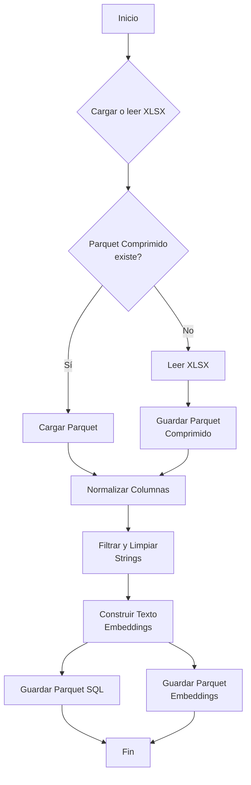
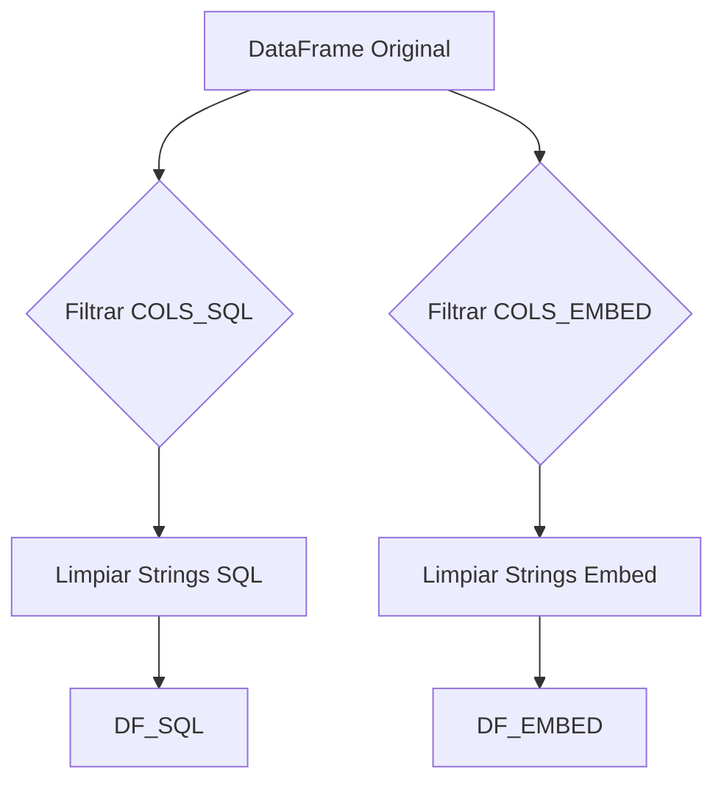

## Proceso de Preprocesamiento de Datos

### Related Pages

Related topics: [Visión General y Arquitectura del Sistema](#page-1), [API RESTful y Lógica de Backend](#page-3)

<details>
<summary>Relevant source files</summary>

- [preprocesar.py](https://github.com/joeCuadros/IA_TABD/blob/main/preprocesar.py)
- [api/templates/index.html](https://github.com/joeCuadros/IA_TABD/blob/main/api/templates/index.html)
- [api/main.py](https://github.com/joeCuadros/IA_TABD/blob/main/api/main.py)
- [data/DataSet-Obras-Publicas 12-05-2026.xlsx](https://github.com/joeCuadros/IA_TABD/blob/main/data/DataSet-Obras-Publicas 12-05-2026.xlsx)
- [data/DataSet-Obras-Publicas 12-05-2026.parquet](https://github.com/joeCuadros/IA_TABD/blob/main/data/DataSet-Obras-Publicas 12-05-2026.parquet)
- [data/data_sql.parquet](https://github.com/joeCuadros/IA_TABD/blob/main/data/data_sql.parquet)
- [data/data_procesada.parquet](https://github.com/joeCuadros/IA_TABD/blob/main/data/data_procesada.parquet)
</details>

# Proceso de Preprocesamiento de Datos

El script `preprocesar.py` es fundamental para la preparación y transformación de los datos brutos de obras públicas. Su propósito principal es ingestar un archivo Excel con información de obras, limpiarlo, normalizar sus columnas y generar conjuntos de datos estructurados en formato Parquet, adecuados para diferentes usos dentro del proyecto, como el almacenamiento en una base de datos PostgreSQL y la generación de embeddings para capacidades de búsqueda semántica.

Este proceso garantiza la calidad y coherencia de los datos, lo que es crucial para la precisión de la búsqueda semántica y la funcionalidad de la [API de Obras](#salidas-procesadas).

## Flujo General del Preprocesamiento

El proceso de preprocesamiento sigue una serie de fases secuenciales, desde la carga inicial de los datos hasta la generación de los archivos Parquet finales.


Sources: [preprocesar.py:44-55, 61-82, 94-98, 101-105, 114-118]()

## Carga y Compresión Inicial de Datos

La primera fase del preprocesamiento se encarga de la ingesta del archivo de datos original y su optimización para lecturas futuras.

El script define las rutas para el archivo Excel de origen (`XLSX_PURO`) y un archivo Parquet comprimido intermedio (`PARQUET_COMPRIMIDO`). Al ejecutarse, primero verifica si el archivo Parquet comprimido ya existe. Si no existe, lee el archivo Excel original, que se espera que tenga el encabezado en la cuarta fila (`header=3`), y luego lo guarda como un archivo Parquet para mejorar el rendimiento en subsiguientes ejecuciones. Si el Parquet comprimido ya existe, lo carga directamente.
Sources: [preprocesar.py:10-13, 44-55]()

```python
# preprocesar.py
# Fase 0: Comprimir data para facil lectura
if PARQUET_COMPRIMIDO.exists():
    imprimir_color("Cargando parquet...")
    df = pd.read_parquet(PARQUET_COMPRIMIDO)
else:
    print("Parquet no encontrado")
    print("Leyendo Excel...")
    df = pd.read_excel(
        XLSX_PURO,
        header=3
    )
    imprimir_color("Guardando parquet...")
    df.to_parquet(
        PARQUET_COMPRIMIDO,
        index=False
    )
```
Sources: [preprocesar.py:44-55]()

## Normalización de Nombres de Columnas

Una vez cargados los datos, los nombres de las columnas son estandarizados para asegurar consistencia y facilitar su manejo programático.

La función `normalizar_columnas` itera sobre todos los nombres de columna del DataFrame y aplica la función `normalizar_columna` a cada uno. Esta función realiza una serie de transformaciones:
1.  Elimina espacios en blanco al inicio y final.
2.  Convierte el texto a minúsculas.
3.  Reemplaza caracteres acentuados (á, é, í, ó, ú, ñ) por sus equivalentes sin acento.
4.  Elimina caracteres especiales como `¿`, `?`, `%`, `°`.
5.  Reemplaza cualquier secuencia de caracteres no alfanuméricos por un guion bajo (`_`).
6.  Colapsa múltiples guiones bajos consecutivos en uno solo.
7.  Elimina guiones bajos al inicio y al final.
Un `defaultdict` se utiliza para manejar posibles nombres de columna duplicados después de la normalización, añadiendo un sufijo numérico si es necesario.
Sources: [preprocesar.py:61-82]()

```python
# preprocesar.py
def normalizar_columnas(cols):    
    def normalizar_columna(col):
        col = col.strip().lower()
        reemplazos = {
            "á": "a", "é": "e", "í": "i", "ó": "o", "ú": "u", "ñ": "n"
        }
        for a, b in reemplazos.items():
            col = col.replace(a, b)
        col = re.sub(r"[¿?%°]", "", col)
        col = re.sub(r"[^a-z0-9]+", "_", col)
        col = re.sub(r"_+", "_", col)
        return col.strip("_")
    # ... (código para manejar duplicados)
```
Sources: [preprocesar.py:61-75]()

## Filtrado y Limpieza de Contenido

Después de normalizar los nombres, el script filtra y limpia los valores de las columnas.

### Filtrado de Columnas
La función `filtrar_cols` toma un DataFrame y una lista de columnas deseadas. Devuelve un nuevo DataFrame que solo contiene las columnas especificadas que realmente existen en el DataFrame de entrada. Si alguna columna de la lista deseada no se encuentra, se imprime una advertencia.
Sources: [preprocesar.py:94-98]()

### Limpieza de Strings
La función `limpiar_strings` itera sobre todas las columnas del DataFrame que son de tipo `object` o `string` (típicamente texto). Para cada una de estas columnas, aplica el método `.str.strip()` para eliminar espacios en blanco iniciales y finales de todas las entradas de texto.
Sources: [preprocesar.py:101-105]()

### Conjuntos de Columnas Clave
El script define dos listas principales de columnas, `COLS_SQL` y `COLS_EMBED`, que dictan qué datos se conservarán para los diferentes propósitos:

*   **`COLS_SQL`**: Contiene un conjunto extenso de columnas que incluyen identificadores, descripción de la obra, entidad, ubicación, montos, fechas clave, avance, contratista y banderas/contadores útiles. Estas columnas están destinadas a ser cargadas en una base de datos PostgreSQL para ser consumidas por la API.
    Sources: [preprocesar.py:204-266]()
*   **`COLS_EMBED`**: Contiene un subconjunto de columnas principalmente textuales y de identificación, como el código, nombre de la obra, proyecto, naturaleza, tipos de obra, entidad, sector, ubicación, modalidad, estado y comentarios. Estas columnas se utilizarán para construir el texto de entrada para la generación de embeddings.
    Sources: [preprocesar.py:269-286]()



## Generación de Texto para Embeddings

Una de las etapas clave del preprocesamiento es la creación de una representación textual consolidada de cada obra, optimizada para la generación de embeddings.

La función `construir_texto_embedding` toma una fila del DataFrame como entrada y concatena varios campos textuales en una única cadena coherente. Esta cadena está diseñada para ser la entrada del modelo `all-MiniLM-L6-v2`, que generará representaciones vectoriales (embeddings) de las obras. La función verifica la existencia de valores (`pd.notna`) antes de añadirlos, y los formatea con prefijos descriptivos (ej., "Obra: ", "Proyecto: ", "Tipo: ").
Sources: [preprocesar.py:107-156]()

Los campos utilizados para construir este texto incluyen:
*   `nombre_de_obra`
*   `nombre_proyecto`
*   `tipo_de_obra_clasificador_nivel_1`, `nivel_2`, `nivel_3`
*   `naturaleza_de_la_obra`
*   `departamento`, `provincia`, `distrito`
*   `direccion_o_informacion_de_referencia`
*   `entidad_publica`
*   `sector_de_la_entidad`
*   `modalidad_de_ejecucion_de_la_obra`
*   `estado_de_ejecucion`
*   `comentarios`
Sources: [preprocesar.py:119-155, 269-286]()

```mermaid
graph TD
    A[Fila de Obra] --> B{nombre_de_obra?};
    B -- Sí --> C[Obra: [nombre_de_obra]];
    A --> D{nombre_proyecto?};
    D -- Sí --> E[Proyecto: [nombre_proyecto]];
    A --> F{Niveles de Tipo<br>de Obra?};
    F -- Sí --> G[Tipo: N1 > N2 > N3];
    A --> H{naturaleza_de_la_obra?};
    H -- Sí --> I[Naturaleza: [naturaleza]];
    A --> J{Ubicación<br> (Dep, Prov, Dist)?};
    J -- Sí --> K[Ubicación: Dep, Prov, Dist];
    A --> L{direccion_o_informacion_de_referencia?};
    L -- Sí --> M[Referencia: [dirección]];
    A --> N{entidad_publica?};
    N -- Sí --> O[Entidad: [entidad]];
    A --> P{sector_de_la_entidad?};
    P -- Sí --> Q[Sector: [sector]];
    A --> R{modalidad_de_ejecucion_de_la_obra?};
    R -- Sí --> S[Modalidad: [modalidad]];
    A --> T{estado_de_ejecucion?};
    T -- Sí --> U[Estado: [estado]];
    A --> V{comentarios?};
    V -- Sí --> W[Comentarios: [comentarios]];
    C & E & G & I & K & M & O & Q & S & U & W --> Z[Unir Partes<br>". "];
    Z --> Final[texto_embedding];
```
Sources: [preprocesar.py:119-155]()

## Salidas Procesadas

El resultado final del preprocesamiento son dos archivos Parquet que sirven a diferentes propósitos dentro de la arquitectura del proyecto.

### Parquet para PostgreSQL (`data_sql.parquet`)
Este archivo (`PARQUET_SQL`) contiene un conjunto completo de columnas, filtradas según la lista `COLS_SQL` y con los strings limpios. Está diseñado para ser cargado en una base de datos PostgreSQL, la cual es utilizada por la API (`api/main.py`) para servir los detalles de las obras y realizar búsquedas filtradas. La API consulta las tablas `obras_sql` y `obras_embeddings`, siendo `obras_sql` la que contendría los datos de este Parquet.
Sources: [preprocesar.py:160-163](), [api/main.py:101-103, 151-152]()

### Parquet para Embeddings en Colab (`data_procesada.parquet`)
Este archivo (`PARQUET_PROCESADO_COLAB`) es una versión más ligera, que solo incluye el `codigo_infobras` y la columna `texto_embedding` generada por la función `construir_texto_embedding`. Este archivo está optimizado para ser consumido por un entorno como Google Colab, donde se generarán los embeddings vectoriales que luego serán utilizados para la búsqueda semántica. La API (`api/main.py`) utiliza estos embeddings de la tabla `obras_embeddings` para calcular la similitud.
Sources: [preprocesar.py:166-171](), [api/main.py:102-103]()

La interfaz de usuario (`api/templates/index.html`) muestra diversos campos de las obras, como `nombre_de_obra`, `departamento`, `entidad_publica`, `estado_de_ejecucion`, `modalidad_de_ejecucion_de_la_obra`, `tipo_de_obra_clasificador_nivel_1`, `monto_del_contrato_en_soles` y `avance_fisico_real_acumulado`, todos ellos presentes en el conjunto de datos `COLS_SQL`.
Sources: [api/templates/index.html:366-376]()

| Archivo de Salida             | Contenido Principal                                  | Propósito                                                                                                                                 |
| :---------------------------- | :--------------------------------------------------- | :---------------------------------------------------------------------------------------------------------------------------------------- |
| `data_sql.parquet`            | Columnas de `COLS_SQL` (filtradas y limpiadas)       | Almacenamiento en PostgreSQL, base para la API de búsqueda y detalle de obras.                                                            |
| `data_procesada.parquet`      | `codigo_infobras`, `texto_embedding`                 | Entrada para la generación de embeddings vectoriales (ej. en Colab) para la búsqueda semántica.                                            |
Sources: [preprocesar.py:160-171](), [api/main.py:101-103]()

## Conclusión

El `Proceso de Preprocesamiento de Datos` es una fase crítica en el proyecto IA_TABD, orquestada principalmente por el script `preprocesar.py`. Este proceso transforma datos brutos de obras públicas en formatos limpios y estructurados, esenciales para las funcionalidades de búsqueda semántica y la API del sistema. La normalización de columnas, la limpieza de strings y la construcción de textos para embeddings son pasos clave que aseguran la calidad y la utilidad de los datos para su consumo por sistemas de machine learning y bases de datos transaccionales.

