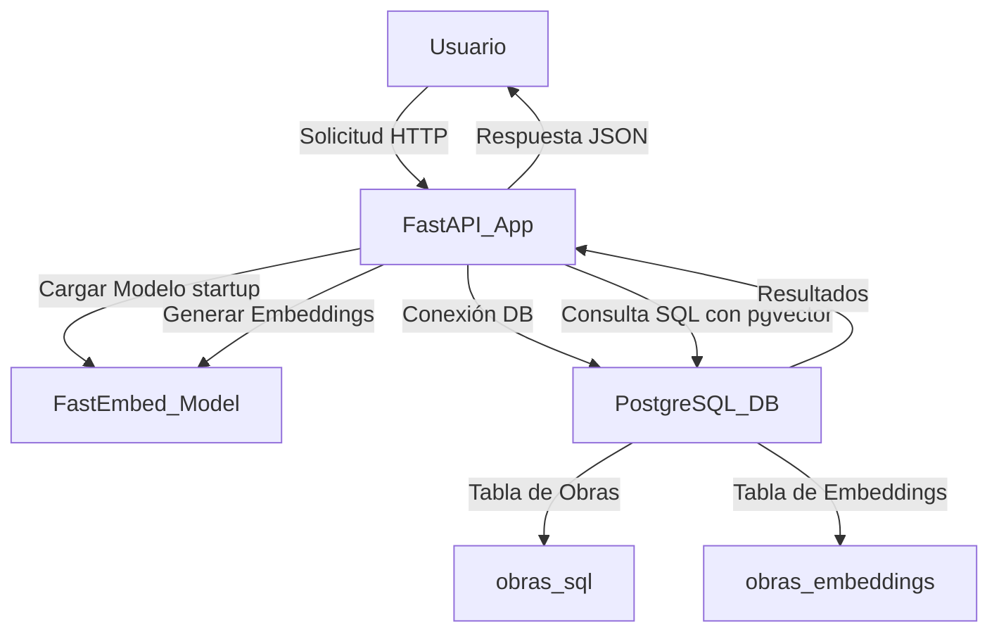
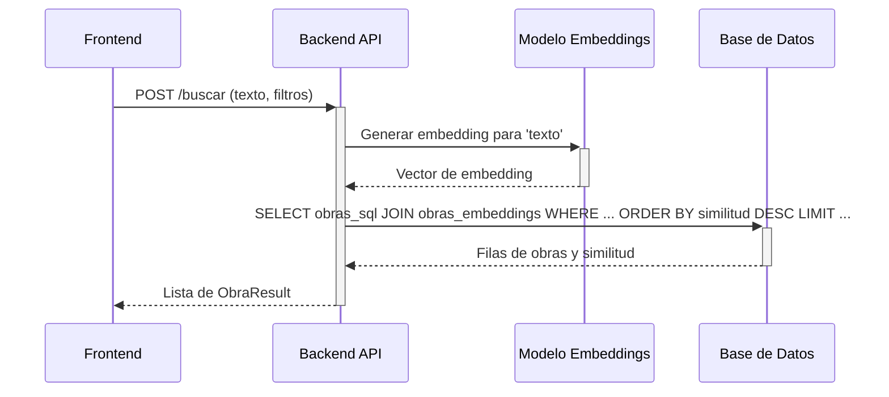

## API RESTful y Lógica de Backend

### Related Pages

Related topics: [Visión General y Arquitectura del Sistema](#page-1), [Proceso de Preprocesamiento de Datos](#page-2), [Interfaz de Usuario (Frontend)](#page-4)

<details>
<summary>Relevant source files</summary>

- [api/main.py](https://github.com/joeCuadros/IA_TABD/blob/main/api/main.py)
- [api/templates/index.html](https://github.com/joeCuadros/IA_TABD/blob/main/api/templates/index.html)
- [preprocesar.py](https://github.com/joeCuadros/IA_TABD/blob/main/preprocesar.py)
- [init/01_schema.sql](https://github.com/joeCuadros/IA_TABD/blob/main/init/01_schema.sql)
- [api/requirements.txt](https://github.com/joeCuadros/IA_TABD/blob/main/api/requirements.txt)
</details>

# API RESTful y Lógica de Backend

La API RESTful y la lógica de backend de este proyecto constituyen el corazón del sistema de búsqueda semántica de obras públicas. Desarrollado con FastAPI, el backend se encarga de procesar las consultas de los usuarios, realizar búsquedas de similitud vectorial en una base de datos PostgreSQL con la extensión `pgvector`, aplicar filtros de metadatos y retornar los resultados relevantes al frontend. También gestiona la recuperación de detalles completos de obras específicas y proporciona endpoints para poblar selectores de filtros.

Este componente es crucial para la funcionalidad principal de "Obras.PE", transformando las entradas de texto libre en búsquedas inteligentes y facilitando la exploración de datos estructurados de obras. La preparación de los datos para la búsqueda semántica se realiza mediante un script de preprocesamiento independiente que genera los textos para los embeddings.

## Arquitectura General del Backend

El backend se construye utilizando FastAPI, un framework web moderno y rápido para construir APIs con Python 3.7+. Integra `FastEmbed` para la generación de embeddings de texto y `psycopg2` junto con `pgvector` para la interacción con una base de datos PostgreSQL que almacena tanto los datos de las obras como sus representaciones vectoriales. La aplicación utiliza un mecanismo de `lifespan` para cargar el modelo de embeddings una única vez al inicio, optimizando el rendimiento.


Fuentes: [api/main.py:28-31](), [api/main.py:44-50](), [api/main.py:53-57]()

La aplicación FastAPI incluye un middleware CORS para permitir solicitudes desde diferentes orígenes, lo que es útil para el desarrollo o para escenarios donde el frontend y el backend se alojan en dominios distintos.
Fuentes: [api/main.py:60-65]()

## Modelos de Datos y Esquemas

La API define modelos Pydantic para estructurar las solicitudes y respuestas, asegurando la validación y serialización de los datos.

### `BusquedaRequest`

Este modelo representa los parámetros de entrada para la solicitud de búsqueda semántica, combinando un texto libre con filtros opcionales de metadatos.

```python
# api/main.py
class BusquedaRequest(BaseModel):
    texto: str = Field(..., min_length=3, description="Texto libre a buscar")
    top:   int = Field(10, ge=1, le=25, description="Resultados a retornar (máx 25)")

    # Filtros opcionales
    departamento:                      Optional[str] = None
    provincia:                         Optional[str] = None
    distrito:                          Optional[str] = None
    nivel_de_gobierno:                 Optional[str]
```
Fuentes: [api/main.py:69-80]()

Los campos opcionales permiten refinar la búsqueda por atributos específicos de las obras.

| Campo                 | Tipo          | Descripción                                 |
| :-------------------- | :------------ | :------------------------------------------ |
| `texto`               | `str`         | Texto libre para la búsqueda semántica.    |
| `top`                 | `int`         | Número máximo de resultados a retornar (1-25). |
| `departamento`        | `Optional[str]` | Filtro por departamento.                    |
| `provincia`           | `Optional[str]` | Filtro por provincia.                       |
| `distrito`            | `Optional[str]` | Filtro por distrito.                        |
| `nivel_de_gobierno`   | `Optional[str]` | Filtro por nivel de gobierno.               |
| ...                   | ...           | ...                                         |
Fuentes: [api/main.py:69-80]()

### `ObraResult`

Este modelo define la estructura de los resultados retornados por el endpoint de búsqueda. Incluye campos clave de la obra y la similitud calculada.

```python
# api/main.py
class ObraResult(BaseModel):
    codigo_infobras:                    str
    nombre_de_obra:                     str
    naturaleza_de_la_obra:              Optional[str]
    tipo_de_obra_clasificador_nivel_1:  Optional[str]
    tipo_de_obra_clasificador_nivel_2:  Optional[str]
    tipo_de_obra_clasificador_nivel_3:  Optional[str]
    modalidad_de_ejecucion_de_la_obra:  Optional[str]
    estado_de_ejecucion:                Optional[str]
    entidad_publica:                    Optional[str]
    nivel_de_gobierno:                  Optional[str]
    sector_de_la_entidad:               Optional[str]
    departamento:                       Optional[str]
    provincia:                          Optional[str]
    distrito:                           Optional[str]
    monto_del_contrato_en_soles:        Optional[float]
    avance_fisico_real_acumulado:       Optional[float]
    fecha_de_inicio_de_obra:            Optional[str]
    fecha_de_finalizacion_real:         Optional[str]
    similitud:                          float
```
Fuentes: [api/main.py:83-103]()

## Endpoints de la API RESTful

La API expone varios endpoints para interactuar con los datos de las obras.

### Búsqueda Semántica (`POST /buscar`)

Este es el endpoint principal para realizar búsquedas. Recibe un `BusquedaRequest` y retorna una lista de `ObraResult` ordenadas por similitud.


Fuentes: [api/main.py:175-197]()

La consulta SQL combina la tabla `obras_sql` con `obras_embeddings` usando `codigo_infobras` y calcula la similitud vectorial.

```sql
-- api/main.py (fragmento de la query)
SELECT
    o.codigo_infobras,
    o.nombre_de_obra,
    o.naturaleza_de_la_obra,
    -- ... otros campos ...
    o.fecha_de_finalizacion_real,
    1 - (e.embedding <=> %s::vector) AS similitud
FROM obras_sql o
JOIN obras_embeddings e USING (codigo_infobras)
{where}
ORDER BY similitud DESC
LIMIT %s;
```
Fuentes: [api/main.py:182-195]()

El texto para los embeddings se construye previamente a partir de múltiples campos textuales de la obra en el script `preprocesar.py`.
Fuentes: [preprocesar.py:34-83]()

### Detalle de Obra (`GET /obras/{codigo_infobras}`)

Este endpoint permite recuperar todos los campos de una obra específica utilizando su `codigo_infobras`.

```python
# api/main.py
@app.get("/obras/{codigo_infobras}", tags=["Obras"])
def detalle_obra(codigo_infobras: str):
    """Retorna todos los campos de una obra por su código."""
    try:
        conn = get_conn()
        cur  = conn.cursor()
        cur.execute(
            "SELECT * FROM obras_sql WHERE codigo_infobras = %s;",
            (codigo_infobras,)
        )
        row = cur.fetchone()
        if not row:
            raise HTTPException(status_code=404, detail="Obra no encontrada")
        cols = [desc[0] for desc in cur.description]
        cur.close()
        conn.close()
    except HTTPException:
        raise
    except Exception as e:
        raise HTTPException(status_code=500, detail=str(e))

    return dict(zip(cols, row))
```
Fuentes: [api/main.py:202-225]()

### Selects para el Frontend (`GET /selects/...`)

Una serie de endpoints `GET` están disponibles para poblar los selectores (dropdowns) en la interfaz de usuario con valores únicos de columnas específicas. Algunos de estos selectores permiten filtrar por un "padre" (ej. provincias por departamento).

| Endpoint                        | Descripción                                     | Parámetros |
| :------------------------------ | :---------------------------------------------- | :--------- |
| `/selects/departamentos`        | Retorna una lista de departamentos únicos.      | Ninguno    |
| `/selects/provincias`           | Retorna provincias únicas, opcionalmente filtradas por departamento. | `departamento: Optional[str]` |
| `/selects/distritos`            | Retorna distritos únicos, opcionalmente filtrados por provincia. | `provincia: Optional[str]` |
| `/selects/niveles-gobierno`     | Retorna niveles de gobierno únicos.             | Ninguno    |
| `/selects/sectores`             | Retorna sectores únicos.                        | Ninguno    |
| `/selects/naturalezas`          | Retorna naturalezas de obra únicas.             | Ninguno    |
| `/selects/tipos-nivel-1`        | Retorna tipos de obra nivel 1 únicos.           | Ninguno    |
| `/selects/tipos-nivel-2`        | Retorna tipos de obra nivel 2 únicos, opcionalmente filtrados por nivel 1. | `nivel1: Optional[str]` |
| `/selects/modalidades`          | Retorna modalidades de ejecución únicas.        | Ninguno    |
Fuentes: [api/main.py:230-264]()

## Lógica de procesamiento y ayudantes

El backend incluye funciones auxiliares para construir consultas SQL y recuperar datos distintos.

### `build_where` Función

Esta función construye dinámicamente la cláusula `WHERE` para las consultas SQL basándose en los filtros proporcionados en el `BusquedaRequest`. Maneja campos de texto con búsquedas `ILIKE` y rangos numéricos.

```python
# api/main.py
def build_where(filters: dict) -> tuple[str, list]:
    clauses = []
    params  = []

    text_fields = [
        "departamento", "provincia", "distrito",
        "nivel_de_gobierno", "sector_de_la_entidad",
        "naturaleza_de_la_obra",
        "tipo_de_obra_clasificador_nivel_1",
        "tipo_de_obra_clasificador_nivel_2",
        "modalidad_de_ejecucion_de_la_obra",
        "estado_de_ejecucion",
    ]
    for field in text_fields:
        val = filters.get(field)
        if val:
            clauses.append(f"o.{field} ILIKE %s")
            params.append(f"%{val}%")

    if filters.get("monto_min") is not None:
        clauses.append("o.monto_del_contrato_en_soles >= %s")
        params.append(filters["monto_min"])

    if filters.get("monto_max") is not None:
        clauses.append("o.monto_del_contrato_en_soles <= %s")
        params.append(filters["monto_max"])

    where = ("WHERE " + " AND ".join(clauses)) if clauses else ""
    return where, params
```
Fuentes: [api/main.py:108-139]()

### `_distinct` Función

Esta función genérica recupera valores distintos de una columna de la tabla `obras_sql`, con la opción de filtrar por una columna "padre".

```python
# api/main.py
def _distinct(col: str, parent_col: str = None, parent_val: str = None) -> list[str]:
    if parent_col and parent_val:
        query = f"""
            SELECT DISTINCT {col}
            FROM obras_sql
            WHERE {parent_col} ILIKE %s
              AND {col} IS NOT NULL
            ORDER BY {col};
        """
        params = [parent_val]
    else:
        query = f"""
            SELECT DISTINCT {col}
            FROM obras_sql
            WHERE {col} IS NOT NULL
            ORDER BY {col};
        """
        params = []

    conn = get_conn()
    cur  = conn.cursor()
    cur.execute(query, params)
    rows = [r[0] for r in cur.fetchall()]
    cur.close()
    conn.close()
    return rows
```
Fuentes: [api/main.py:142-171]()

### `construir_texto_embedding` (Procesamiento de Datos)

Aunque implementada en `preprocesar.py`, esta función es fundamental para la lógica del backend, ya que prepara la cadena de texto que será vectorizada por `FastEmbed`. Concatena campos como nombre de obra, proyecto, tipo, naturaleza, ubicación, entidad, sector, modalidad, estado y comentarios en un formato coherente.

```python
# preprocesar.py
def construir_texto_embedding(row):
    """
    Concatena los campos textuales en una sola cadena coherente
    que el modelo all-MiniLM-L6-v2 va a encodear.
    """
    partes = []

    if pd.notna(row.get("nombre_de_obra")):
        partes.append(f"Obra: {row['nombre_de_obra']}")

    # ... otros campos ...

    if pd.notna(row.get("comentarios")) and str(row["comentarios"]).strip():
        partes.append(f"Comentarios: {row['comentarios']}")

    return ". ".join(partes)
```
Fuentes: [preprocesar.py:34-83]()

## Configuración y Dependencias

La configuración de la base de datos se maneja a través de variables de entorno, lo que facilita la gestión de credenciales.
Fuentes: [api/main.py:28-31]()

Las principales dependencias del backend, según los imports en `api/main.py`, incluyen:
*   `FastAPI`: El framework web principal.
*   `psycopg2`: Adaptador de PostgreSQL para Python.
*   `pgvector`: Extensión para `psycopg2` que permite el manejo de vectores.
*   `fastembed`: Biblioteca para generar embeddings de texto.
*   `python-dotenv`: Para cargar variables de entorno.
*   `uvicorn`: Servidor ASGI para ejecutar la aplicación FastAPI (no directamente importado en `main.py` pero es el servidor común).
Fuentes: [api/main.py:4-15]()

## Conclusión

La API RESTful y la lógica de backend del proyecto IA_TABD proporcionan una robusta solución para la búsqueda semántica de obras públicas. Utilizando FastAPI, PostgreSQL con `pgvector` y FastEmbed, el sistema ofrece una interfaz eficiente para consultas de texto libre combinadas con filtrado de metadatos. La modularidad de los endpoints y las funciones auxiliares, junto con la preparación de datos, asegura un rendimiento óptimo y una experiencia de usuario intuitiva para explorar el conjunto de datos de Infobras.

