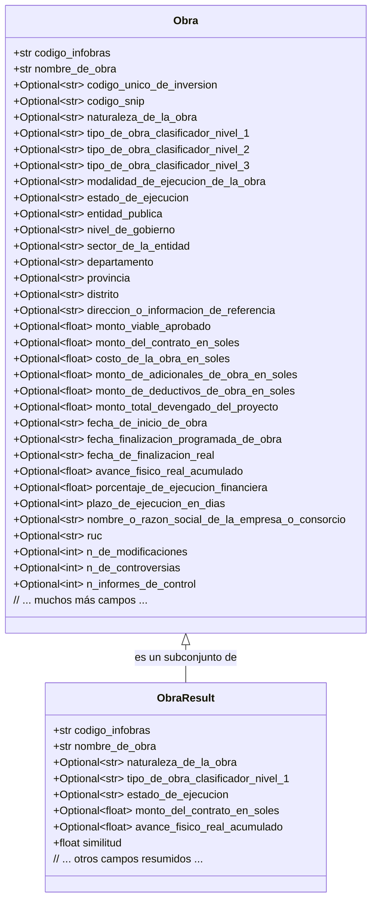

## Interfaz de Usuario (Frontend)

### Related Pages

Related topics: [Visión General y Arquitectura del Sistema](#page-1), [API RESTful y Lógica de Backend](#page-3)

<details>
<summary>Relevant source files</summary>

Los siguientes archivos fueron utilizados como contexto para generar esta página wiki:

- [api/templates/index.html](https://github.com/joeCuadros/IA_TABD/blob/main/api/templates/index.html)
- [api/main.py](https://github.com/joeCuadros/IA_TABD/blob/main/api/main.py)
- [preprocesar.py](https://github.com/joeCuadros/IA_TABD/blob/main/preprocesar.py)
- [Dockerfile]()
- [requirements.txt]()
</details>

# Interfaz de Usuario (Frontend)

La Interfaz de Usuario (Frontend) del proyecto IA_TABD es la capa de presentación que permite a los usuarios interactuar con el sistema de búsqueda semántica de obras públicas. Su propósito principal es proporcionar una experiencia intuitiva para consultar información de obras (Infobras), mostrar los resultados de búsqueda de manera organizada y presentar detalles exhaustivos de cada obra seleccionada.

El frontend está implementado como una aplicación de una sola página (SPA) que se sirve directamente desde el backend de FastAPI. Utiliza HTML, CSS (incrustado) y JavaScript (incrustado) para renderizar la interfaz y manejar la lógica del cliente, interactuando dinámicamente con la API del backend para obtener y mostrar los datos. Este diseño permite una rápida iteración y una experiencia de usuario fluida, sin recargas completas de página.

## Estructura del Documento HTML (`index.html`)

El archivo `api/templates/index.html` define la estructura principal de la interfaz de usuario. Es un documento HTML5 estándar que incluye estilos CSS incrustados en una etiqueta `<style>` y la lógica de JavaScript incrustada en una etiqueta `<script>` al final del `<body>`.

La estructura general del documento organiza la página en bloques lógicos:

*   **Encabezado (`header`):** Contiene el logo y un indicador de estado de conexión.
*   **Panel de Búsqueda (`search-panel`):** Incluye el campo de entrada para la consulta y opciones de filtrado.
*   **Panel de Resultados (`results-panel`):** Muestra el conteo de resultados, un indicador de carga y la cuadrícula donde se renderizan las tarjetas de obras.
*   **Estado Vacío (`empty-state`):** Mensaje que se muestra cuando no hay resultados o la búsqueda no ha comenzado.
*   **Modal de Detalle (`modal-overlay`):** Un componente superpuesto para mostrar información detallada de una obra específica.

```html
<!DOCTYPE html>
<html lang="es">
<head>
    <meta charset="UTF-8">
    <meta name="viewport" content="width=device-width, initial-scale=1.0">
    <title>Obras Públicas — Buscador</title>
    <link href="https://fonts.googleapis.com/css2?family=Syne:wght@400;600;700;800&family=DM+Mono:wght@300;400;500&display=swap" rel="stylesheet">
    <style>
        /* ... CSS styles ... */
    </style>
</head>
<body>
    <div class="glow-orb"></div>
    <div class="glow-orb2"></div>
    <div class="wrapper">
        <!-- HEADER -->
        <header>...</header>
        <!-- SEARCH PANEL -->
        <div class="search-panel">...</div>
        <!-- RESULTS PANEL -->
        <div class="results-panel">...</div>
        <div class="results-grid" id="resultsGrid"></div>
        <div class="empty-state" id="emptyState">...</div>
    </div>
    <!-- MODAL DETALLE -->
    <div class="modal-overlay" id="modalOverlay">...</div>
    <script>
        // ... JavaScript logic ...
    </script>
</body>
</html>
```
Sources: [api/templates/index.html:1-25, 41-45, 102-106, 110-117, 280-296]()

## Estilos y Diseño (CSS)

Los estilos de la interfaz se definen directamente en la etiqueta `<style>` dentro de `api/templates/index.html`. Se utilizan variables CSS (`:root`) para gestionar una paleta de colores coherente, lo que facilita el mantenimiento y la personalización del tema.

```css
:root {
    --bg: #0a0a0f;
    --surface: #111118;
    --border: #1e1e2e;
    --accent: #00e5a0;
    --accent2: #005cff;
    --muted: #3a3a5c;
    --text: #e8e8f0;
    --text-dim: #6b6b8a;
    --danger: #ff4566;
    --card-bg: #13131c;
}
```
Sources: [api/templates/index.html:14-24]()

Además de la definición de variables, el CSS incluye:
*   Importación de fuentes de Google Fonts ('Syne' y 'DM Mono').
*   Estilos globales para `body`, `wrapper`, y elementos comunes.
*   Estilos específicos para componentes como el encabezado, el panel de búsqueda, las tarjetas de resultados (`card`), y el modal de detalle.
*   Definición de animaciones (`@keyframes slideUp`) para transiciones de elementos.
*   Personalización de la barra de desplazamiento (`::-webkit-scrollbar`).
Sources: [api/templates/index.html:7-10, 26-100, 258-278]()

## Lógica del Cliente (JavaScript)

Toda la interactividad del frontend se maneja mediante JavaScript incrustado en `api/templates/index.html`.

### Utilidades y Formateadores

Se definen varias funciones de utilidad para el formateo de datos y la gestión de estilos:

*   `API`: Una constante que almacena la URL base de la API (vacía, indicando el mismo origen que el servidor FastAPI).
*   `fmt(v)`: Formatea valores nulos o vacíos a un guion "—".
*   `fmtMoney(v)`: Formatea valores numéricos a formato de moneda peruana (S/) con dos decimales.
*   `fmtPct(v)`: Formatea valores numéricos a porcentaje con un decimal.
*   `estadoClass(e)`: Asigna una clase CSS basada en el estado de ejecución de la obra para estilizar las etiquetas.

```javascript
const API = '';  // mismo origen — FastAPI sirve este HTML

//  UTILS 
const fmt = (v) => v != null && v !== '' ? v : '—';
const fmtMoney = (v) => v != null && v !== 0
    ? 'S/ ' + Number(v).toLocaleString('es-PE', { minimumFractionDigits: 2 })
    : '—';
const fmtPct = (v) => v != null ? Number(v).toFixed(1) + '%' : '—';

function estadoClass(e) {
    if (e === 'FINALIZADA') return 'estado-fin';
    if (e === 'EN EJECUCION') return 'estado-eje';
    return '';
}
```
Sources: [api/templates/index.html:298-311]()

### Flujo de Búsqueda y Renderizado de Resultados

La función `search()` es el núcleo de la interactividad de búsqueda. Se encarga de recoger la consulta del usuario, realizar la llamada a la API y renderizar los resultados.

```javascript
sequenceDiagram
    participant Usuario
    participant Frontend as index.html
    participant Backend as main.py
    participant DB as Base de Datos

    Usuario->>+Frontend: Escribe consulta en queryInput
    Frontend->>Frontend: debounceInput() (retardo)
    Frontend->>+Backend: GET /search?q={query}&top={top}&...
    Backend->>DB: Consulta obras_sql y obras_embeddings
    DB-->>Backend: Resultados de obras (ObraResult)
    Backend-->>-Frontend: Lista de ObraResult
    Frontend->>Frontend: renderResults(obras, query)
    Frontend->>Frontend: Actualiza #resultsCount, oculta #loader
    Frontend-->>-Usuario: Muestra tarjetas de obras
```
Sources: [api/templates/index.html:313-317, 332-340](), [api/main.py:83-102]()

La función `renderResults(obras, query)` toma la lista de obras retornada por la API y construye dinámicamente el HTML para cada tarjeta de obra, insertándolas en el `resultsGrid`. Cada tarjeta muestra información clave como el nombre de la obra, ubicación, entidad, estado, modalidad, tipo, monto del contrato, avance físico real y un porcentaje de similitud con la consulta. Un evento `onclick` en cada tarjeta permite ver los detalles completos de la obra.

```javascript
function renderResults(obras, query) {
    // ... lógica para mostrar/ocultar elementos ...
    document.getElementById('resultsGrid').innerHTML = obras.map(o => {
        const sim = (o.similitud * 100).toFixed(0);
        const avance = o.avance_fisico_real_acumulado * 100;
        const eClass = estadoClass(o.estado_de_ejecucion);
        return `
            <div class="card" onclick="verDetalle('${o.codigo_infobras}')">
                <div class="card-top">
                    <div class="card-nombre">${fmt(o.nombre_de_obra)}</div>
                    <div class="sim-badge">${sim}% match</div>
                </div>
                <div class="card-meta">
                    ${o.departamento ? `<span>📍 ${o.departamento}${o.provincia ? ' / ' + o.provincia : ''}</span>` : ''}
                    ${o.entidad_publica ? `<span>🏛 ${o.entidad_publica}</span>` : ''}
                    ${o.estado_de_ejecucion ? `<span class="tag ${eClass}">${o.estado_de_ejecucion}</span>` : ''}
                    ${o.modalidad_de_ejecucion_de_la_obra ? `<span class="tag">${o.modalidad_de_ejecucion_de_la_obra}</span>` : ''}
                    ${o.tipo_de_obra_clasificador_nivel_1 ? `<span class="tag">${o.tipo_de_obra_clasificador_nivel_1}</span>` : ''}
                </div>
                <div class="card-bottom">
                    <div class="monto">${fmtMoney(o.monto_del_contrato_en_soles)}</div>
                    <div class="avance-bar-wrap">
                        <div class="avance-bar">
                            <div class="avance-fill" style="width:${Math.min(avance, 100)}%"></div>
                        </div>
                        <span class="avance-pct">${fmtPct(avance)}</span>
                    </div>
                </div>
            </div>`;
    }).join('');
}
```
Sources: [api/templates/index.html:352-386]()

### Funcionalidad de Detalle de Obra

La función asíncrona `verDetalle(codigo)` se encarga de mostrar la información completa de una obra en el modal. Recibe el `codigo_infobras` de la obra, realiza una llamada a la API `/obras/{codigo_infobras}` y construye el contenido HTML del modal con todos los campos disponibles, organizados en secciones como "Identificación", "Clasificación", "Entidad", "Ubicación", "Montos", "Ejecución" y "Contratista".

```javascript
async function verDetalle(codigo) {
    const overlay = document.getElementById('modalOverlay');
    const content = document.getElementById('modalContent');
    content.innerHTML = '<div class="loader active" style="justify-content:center;padding:40px"><div class="spinner"></div></div>';
    overlay.classList.add('active');

    try {
        const o = await fetchJSON('/obras/' + encodeURIComponent(codigo));

        content.innerHTML = `
            <h2>${fmt(o.nombre_de_obra)}</h2>
            <div class="modal-section">
                <div class="modal-section-title">Identificación</div>
                <div class="detail-grid">
                    <div class="detail-item">
                        <div class="detail-label">Código Infobras</div>
                        <div class="detail-value highlight">${fmt(o.codigo_infobras)}</div>
                    </div>
                    <!-- ... más detalles ... -->
                </div>
            </div>
            <!-- ... otras secciones de detalle ... -->
        `;
    } catch {
        content.innerHTML = '<p style="color:var(--danger);padding:20px">Error al cargar el detalle.</p>';
    }
}
```
Sources: [api/templates/index.html:391-402, 404-419, 421-423]()

### Manejo de Eventos

El JavaScript también configura `Event Listeners` para responder a las interacciones del usuario:
*   `DOMContentLoaded`: Inicializa la página.
*   `queryInput` (evento `input`): Activa la búsqueda con un retardo para evitar búsquedas excesivas.
*   `searchButton` (evento `click`): Inicia la búsqueda.
*   `topSelect` (evento `change`): Reinicia la búsqueda al cambiar la cantidad de resultados.
*   `modalClose` (evento `click`): Cierra el modal de detalle.
*   `modalOverlay` (evento `click`): Cierra el modal si se hace clic fuera de su contenido.
Sources: [api/templates/index.html:343-349, 425-429]()

## Interacción con la API Backend

El frontend se comunica con la API RESTful implementada en `api/main.py`. Esta API es responsable de la lógica de búsqueda semántica y de la recuperación de detalles de las obras desde la base de datos.

### Modelo de Datos `ObraResult` para Búsqueda

Cuando el frontend realiza una búsqueda a través del endpoint `/search`, el backend devuelve una lista de objetos `ObraResult`. Este modelo Pydantic define un subconjunto de los campos de una obra, optimizado para la visualización en las tarjetas de resultados de búsqueda.

```python
class ObraResult(BaseModel):
    codigo_infobras:                    str
    nombre_de_obra:                     str
    naturaleza_de_la_obra:              Optional[str]
    tipo_de_obra_clasificador_nivel_1:  Optional[str]
    tipo_de_obra_clasificador_nivel_2:  Optional[str]
    tipo_de_obra_clasificador_nivel_3:  Optional[str]
    modalidad_de_ejecucion_de_la_obra:  Optional[str]
    estado_de_ejecucion:                Optional[str]
    entidad_publica:                    Optional[str]
    nivel_de_gobierno:                  Optional[str]
    sector_de_la_entidad:               Optional[str]
    departamento:                       Optional[str]
    provincia:                          Optional[str]
    distrito:                           Optional[str]
    monto_del_contrato_en_soles:        Optional[float]
    avance_fisico_real_acumulado:       Optional[float]
    fecha_de_inicio_de_obra:            Optional[str]
    fecha_de_finalizacion_real:         Optional[str]
    similitud:                          float
```
Sources: [api/main.py:38-58]()

| Campo                             | Tipo            | Descripción                                                  |
| :-------------------------------- | :-------------- | :----------------------------------------------------------- |
| `codigo_infobras`                 | `str`           | Código único de la obra en Infobras.                         |
| `nombre_de_obra`                  | `str`           | Nombre descriptivo de la obra.                               |
| `naturaleza_de_la_obra`           | `Optional[str]` | Naturaleza de la obra (e.g., inversión, mantenimiento).      |
| `tipo_de_obra_clasificador_nivel_1` | `Optional[str]` | Nivel 1 de clasificación de la obra.                         |
| `tipo_de_obra_clasificador_nivel_2` | `Optional[str]` | Nivel 2 de clasificación de la obra.                         |
| `tipo_de_obra_clasificador_nivel_3` | `Optional[str]` | Nivel 3 de clasificación de la obra.                         |
| `modalidad_de_ejecucion_de_la_obra` | `Optional[str]` | Modalidad de ejecución (e.g., administración directa, contrato). |
| `estado_de_ejecucion`             | `Optional[str]` | Estado actual de la obra (e.g., EN EJECUCION, FINALIZADA).   |
| `entidad_publica`                 | `Optional[str]` | Nombre de la entidad pública responsable.                    |
| `nivel_de_gobierno`               | `Optional[str]` | Nivel de gobierno de la entidad.                             |
| `sector_de_la_entidad`            | `Optional[str]` | Sector al que pertenece la entidad.                          |
| `departamento`                    | `Optional[str]` | Departamento de ubicación de la obra.                        |
| `provincia`                       | `Optional[str]` | Provincia de ubicación de la obra.                           |
| `distrito`                        | `Optional[str]` | Distrito de ubicación de la obra.                            |
| `monto_del_contrato_en_soles`     | `Optional[float]` | Monto del contrato en soles.                                 |
| `avance_fisico_real_acumulado`    | `Optional[float]` | Porcentaje de avance físico real acumulado.                  |
| `fecha_de_inicio_de_obra`         | `Optional[str]` | Fecha de inicio de la obra.                                  |
| `fecha_de_finalizacion_real`      | `Optional[str]` | Fecha de finalización real de la obra.                       |
| `similitud`                       | `float`         | Puntuación de similitud con la consulta de búsqueda.         |
Sources: [api/main.py:38-58]()

### Modelo de Datos `Obra` para Detalle

Para la vista de detalle de una obra, el endpoint `/obras/{codigo_infobras}` en `api/main.py` devuelve un objeto `Obra` completo. Este modelo contiene todos los campos relevantes de una obra, incluyendo identificadores, clasificaciones, detalles de la entidad y contratista, montos financieros, fechas clave y métricas de ejecución. El conjunto de columnas utilizadas para construir este objeto se define en la lista `COLS_SQL` en `preprocesar.py`.


Sources: [api/main.py:108-111](), [preprocesar.py:10-76]()

## Conclusión

La Interfaz de Usuario (Frontend) del proyecto IA_TABD es una aplicación web dinámica y responsiva que proporciona una experiencia de búsqueda semántica eficiente para los datos de obras públicas. A través de un diseño centrado en el usuario, estilos claros y una lógica JavaScript robusta, permite a los usuarios buscar, filtrar y explorar detalles complejos de las obras, interactuando de manera transparente con el backend de FastAPI. Su implementación en un único archivo HTML con CSS y JavaScript incrustados facilita el despliegue y la cohesión de la aplicación.
