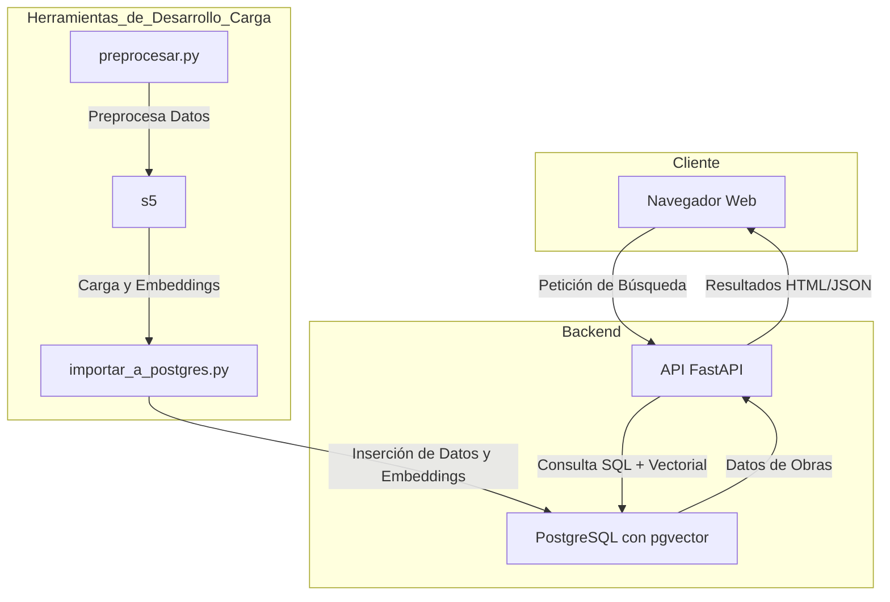
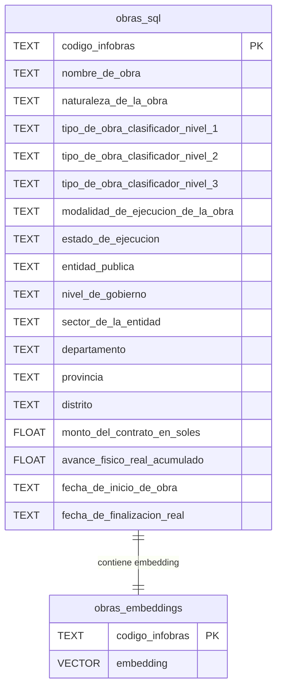
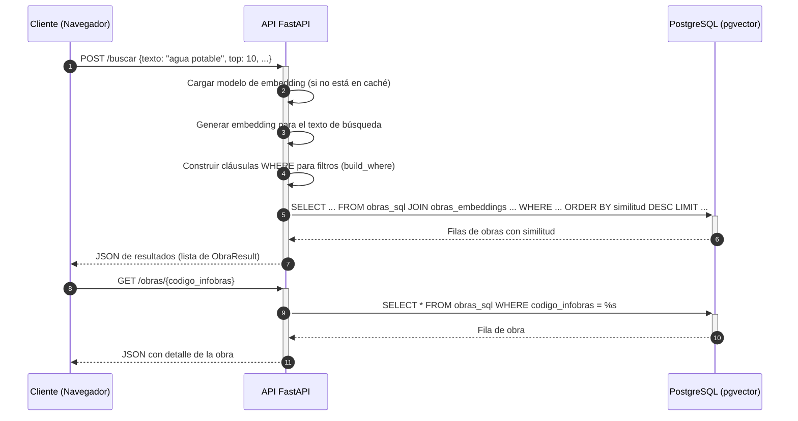

## Despliegue y Configuración del Entorno

### Related Pages

Related topics: [Visión General y Arquitectura del Sistema](#page-1)

<details>
<summary>Relevant source files</summary>

- [api/main.py](https://github.com/joeCuadros/IA_TABD/blob/main/api/main.py)
- [api/templates/index.html](https://github.com/joeCuadros/IA_TABD/blob/main/api/templates/index.html)
- [preprocesar.py](https://github.com/joeCuadros/IA_TABD/blob/main/preprocesar.py)
- [docker-compose.yml](https://github.com/joeCuadros/IA_TABD/blob/main/docker-compose.yml)
- [api/Dockerfile](https://github.com/joeCuadros/IA_TABD/blob/main/api/Dockerfile)
- [.env](https://github.com/joeCuadros/IA_TABD/blob/main/.env)
- [importar_a_postgres.py](https://github.com/joeCuadros/IA_TABD/blob/main/importar_a_postgres.py)
- [init/01_schema.sql](https://github.com/joeCuadros/IA_TABD/blob/main/init/01_schema.sql)
</details>

# Despliegue y Configuración del Entorno

Este documento describe el proceso de despliegue y la configuración del entorno para la aplicación IA_TABD, un sistema de búsqueda semántica de obras públicas. Abarca la arquitectura general, la preparación de datos, la configuración de la base de datos PostgreSQL con soporte para vectores, el servicio API desarrollado con FastAPI y el frontend interactivo, todos orquestados mediante Docker Compose. El objetivo es proporcionar una guía clara para configurar y ejecutar la aplicación de manera autónoma.

## Arquitectura General del Sistema

La aplicación se compone de varios módulos interconectados que trabajan en conjunto para ofrecer la funcionalidad de búsqueda semántica. El flujo principal involucra la preparación de datos, su almacenamiento en una base de datos vectorial, una API que expone la funcionalidad de búsqueda y un frontend web para la interacción del usuario.


Sources: [api/main.py](), [api/templates/index.html](), [preprocesar.py](), [importar_a_postgres.py]()

## Configuración del Entorno (Variables de Entorno)

La configuración de la base de datos y otros parámetros sensibles se gestiona a través de variables de entorno, típicamente definidas en un archivo `.env`. Este archivo es esencial para que los servicios de la API y la base de datos puedan conectarse y operar correctamente.

Las variables de entorno críticas para la conexión a PostgreSQL son:

| Variable           | Descripción                                         | Uso                                           |
| :----------------- | :-------------------------------------------------- | :-------------------------------------------- |
| `POSTGRES_HOST`    | Host de la instancia de PostgreSQL.                 | Conexión a la base de datos.                  |
| `POSTGRES_PORT`    | Puerto de la instancia de PostgreSQL.               | Conexión a la base de datos.                  |
| `POSTGRES_DB`      | Nombre de la base de datos.                         | Conexión a la base de datos.                  |
| `POSTGRES_USER`    | Usuario para acceder a la base de datos.            | Autenticación de la base de datos.            |
| `POSTGRES_PASSWORD`| Contraseña del usuario de la base de datos.         | Autenticación de la base de datos.            |
| `MODEL_NAME`       | Nombre del modelo de embedding a utilizar.          | Carga del modelo de embedding en la API.      |
| `EMBED_ON_IMPORT`  | Bandera para generar embeddings durante la importación. | Controla la generación de embeddings en `importar_a_postgres.py`. |

Un ejemplo de configuración en el archivo `.env` sería:
```
POSTGRES_HOST=db
POSTGRES_PORT=5432
POSTGRES_DB=obrasdb
POSTGRES_USER=user
POSTGRES_PASSWORD=password
MODEL_NAME=sentence-transformers/all-MiniLM-L6-v2
EMBED_ON_IMPORT=True
```
Sources: [.env](), [api/main.py:27-32](), [importar_a_postgres.py]()

## Base de Datos PostgreSQL con `pgvector`

La base de datos utiliza PostgreSQL con la extensión `pgvector` para almacenar los datos de las obras y sus embeddings vectoriales, permitiendo realizar búsquedas de similitud.

### Esquema de la Base de Datos

El esquema se define en `init/01_schema.sql` y consta de dos tablas principales: `obras_sql` para los datos tabulares de las obras y `obras_embeddings` para los vectores de embedding.

```sql
-- init/01_schema.sql
CREATE EXTENSION IF NOT EXISTS vector;

CREATE TABLE IF NOT EXISTS obras_sql (
    codigo_infobras TEXT PRIMARY KEY,
    nombre_de_obra TEXT,
    -- ... otras columnas de datos de la obra
);

CREATE TABLE IF NOT EXISTS obras_embeddings (
    codigo_infobras TEXT PRIMARY KEY REFERENCES obras_sql(codigo_infobras),
    embedding VECTOR(384)
);
```
Sources: [init/01_schema.sql]()


Sources: [init/01_schema.sql](), [api/main.py:65-82]()

### Conexión a la Base de Datos

La API se conecta a PostgreSQL utilizando `psycopg2` y registra la extensión `pgvector` para manejar el tipo de datos `VECTOR`.

```python
# api/main.py
def get_conn():
    conn = psycopg2.connect(**CONN_PARAMS)
    register_vector(conn)
    return conn
```
Sources: [api/main.py:35-38]()

## Preprocesamiento y Carga de Datos

Antes de que los datos puedan ser consultados por la API, deben ser preprocesados y cargados en la base de datos. Este proceso se divide en dos fases principales: preprocesamiento y construcción del texto para embeddings, y la importación de estos datos a PostgreSQL.

### Preprocesamiento de Datos (`preprocesar.py`)

El script `preprocesar.py` es responsable de limpiar, filtrar y transformar los datos brutos de las obras. Genera dos archivos Parquet: uno con los datos tabulares (`obras_sql.parquet`) y otro con el texto concatenado (`obras_embeddings_colab.parquet`) para la generación de embeddings.

La función clave `construir_texto_embedding` concatena varios campos textuales de cada obra en una única cadena, que luego será utilizada para generar el vector de embedding.

```python
# preprocesar.py
def construir_texto_embedding(row):
    """
    Concatena los campos textuales en una sola cadena coherente
    que el modelo all-MiniLM-L6-v2 va a encodear.
    """
    partes = []

    if pd.notna(row.get("nombre_de_obra")):
        partes.append(f"Obra: {row['nombre_de_obra']}")

    if pd.notna(row.get("nombre_proyecto")):
        partes.append(f"Proyecto: {row['nombre_proyecto']}")

    niveles = [
        row.get("tipo_de_obra_clasificador_nivel_1"),
        row.get("tipo_de_obra_clasificador_nivel_2"),
        row.get("tipo_de_obra_clasificador_nivel_3"),
    ]
    niveles = [n for n in niveles if pd.notna(n)]
    if niveles:
        partes.append("Tipo: " + " > ".join(niveles))

    # ... otras partes de la concatenación

    return ". ".join(partes)
```
Sources: [preprocesar.py:48-84]()

### Importación de Datos (`importar_a_postgres.py`)

El script `importar_a_postgres.py` se encarga de cargar los archivos Parquet generados por `preprocesar.py` en las tablas `obras_sql` y `obras_embeddings` de PostgreSQL. Este script también puede generar los embeddings en tiempo de importación si la variable `EMBED_ON_IMPORT` está configurada como `True`.

El proceso de importación implica:
1. Cargar los datos de `obras_sql.parquet` en la tabla `obras_sql`.
2. Cargar `obras_embeddings_colab.parquet`.
3. Para cada fila de `obras_embeddings_colab.parquet`, si `EMBED_ON_IMPORT` es `True`, genera el embedding del `texto_embedding` utilizando el modelo `fastembed` y lo inserta en `obras_embeddings`.
Sources: [importar_a_postgres.py](), [preprocesar.py:108-112]()

## Servicio API (FastAPI)

El corazón del backend es una API construida con FastAPI, que maneja las peticiones de búsqueda semántica, la recuperación de detalles de obras y la provisión de datos para los filtros del frontend.

### `api/Dockerfile`

Este Dockerfile define cómo construir la imagen de Docker para el servicio API. Instala las dependencias necesarias y configura el entorno para ejecutar la aplicación FastAPI.
Sources: [api/Dockerfile]()

### Carga del Modelo de Embedding

Durante el inicio de la aplicación, la función `lifespan` carga el modelo de embedding (`sentence-transformers/all-MiniLM-L6-v2`) en memoria, asegurando que esté disponible para procesar las consultas de búsqueda.

```python
# api/main.py
@asynccontextmanager
async def lifespan(app: FastAPI):
    global MODEL
    print(f"Cargando modelo {MODEL_NAME} con FastEmbed...")
    MODEL = TextEmbedding(MODEL_NAME)
    print("Modelo listo.")
    yield
    print("Shutdown.")
```
Sources: [api/main.py:41-47]()

### Endpoints Principales

La API expone los siguientes endpoints:

*   **GET `/`**: Sirve el archivo `index.html` del frontend.
*   **POST `/buscar`**: Realiza la búsqueda semántica de obras.
    *   **Parámetros de entrada (JSON body - `BusquedaRequest`):**
        *   `texto` (str): Texto libre para la búsqueda (mín. 3 caracteres).
        *   `top` (int): Cantidad de resultados a retornar (1-25).
        *   Filtros opcionales: `departamento`, `provincia`, `distrito`, `nivel_de_gobierno`, `sector_de_la_entidad`, `naturaleza_de_la_obra`, `tipo_de_obra_clasificador_nivel_1`, `tipo_de_obra_clasificador_nivel_2`, `modalidad_de_ejecucion_de_la_obra`, `estado_de_ejecucion`, `monto_min`, `monto_max`.
    *   **Respuesta:** Lista de objetos `ObraResult` con la información de las obras y su similitud.
*   **GET `/obras/{codigo_infobras}`**: Retorna todos los campos de una obra específica por su código Infobras.
*   **GET `/selects/*`**: Endpoints para obtener listas de valores únicos para filtros (ej. `/selects/departamentos`, `/selects/provincias?departamento=Lima`).


Sources: [api/main.py:126-248]()

## Frontend (HTML/JavaScript)

El archivo `api/templates/index.html` es el frontend de la aplicación. Proporciona una interfaz de usuario para que los usuarios puedan ingresar consultas de búsqueda, aplicar filtros y visualizar los resultados.

### Funcionalidades Clave

*   **Buscador de Texto:** Un campo de entrada (`#queryInput`) permite al usuario escribir su consulta.
*   **Filtros Dinámicos:** Dropdowns (`#departamentoSelect`, `#nivelGobiernoSelect`, etc.) se pueblan dinámicamente desde la API (`/selects/*` endpoints) para refinar la búsqueda.
*   **Resultados de Búsqueda:** Los resultados se muestran en una cuadrícula (`#resultsGrid`), con cada obra representada como una tarjeta interactiva.
*   **Detalle de Obra:** Al hacer clic en una tarjeta, se abre un modal (`#modalOverlay`) que muestra información detallada de la obra, obtenida del endpoint `/obras/{codigo_infobras}`.
*   **Formato de Datos:** Funciones JavaScript (`fmt`, `fmtMoney`, `fmtPct`) para formatear los valores de los datos antes de mostrarlos.

```javascript
// api/templates/index.html
async function buscarObras() {
    // ...
    const query = queryInput.value.trim();
    // ...
    const data = await fetchJSON(API + '/buscar', {
        method: 'POST',
        headers: { 'Content-Type': 'application/json' },
        body: JSON.stringify(body)
    });
    // ...
    renderResults(data);
}

async function verDetalle(codigo) {
    // ...
    const o = await fetchJSON('/obras/' + encodeURIComponent(codigo));
    // ...
    renderModalContent(o);
}
```
Sources: [api/templates/index.html]()

## Orquestación con Docker Compose

El archivo `docker-compose.yml` define y ejecuta la aplicación multi-contenedor de Docker. Facilita el despliegue de la base de datos PostgreSQL y el servicio API, asegurando que estén interconectados y configurados correctamente.

```yaml
# docker-compose.yml
services:
  db:
    image: pgvector/pgvector:pg16
    restart: always
    environment:
      POSTGRES_DB: ${POSTGRES_DB}
      POSTGRES_USER: ${POSTGRES_USER}
      POSTGRES_PASSWORD: ${POSTGRES_PASSWORD}
    volumes:
      - db_data:/var/lib/postgresql/data
      - ./init:/docker-entrypoint-initdb.d
    ports:
      - "5432:5432"

  api:
    build: ./api
    restart: always
    ports:
      - "8000:8000"
    environment:
      POSTGRES_HOST: db
      POSTGRES_PORT: 5432
      POSTGRES_DB: ${POSTGRES_DB}
      POSTGRES_USER: ${POSTGRES_USER}
      POSTGRES_PASSWORD: ${POSTGRES_PASSWORD}
      MODEL_NAME: ${MODEL_NAME}
    depends_on:
      db:
        condition: service_healthy
    volumes:
      - ./api:/app/api
      - ./data:/app/data

volumes:
  db_data:
```
Sources: [docker-compose.yml]()

El `docker-compose.yml` define:
*   **`db` servicio:** Utiliza la imagen `pgvector/pgvector:pg16`. Configura las variables de entorno de PostgreSQL, mapea un volumen para la persistencia de datos (`db_data`) y un volumen para scripts de inicialización (`./init:/docker-entrypoint-initdb.d`), y expone el puerto 5432.
*   **`api` servicio:** Construye su imagen a partir del `Dockerfile` en el directorio `./api`. Expone el puerto 8000, configura las variables de entorno para la conexión a la base de datos y la carga del modelo de embedding, y declara una dependencia en el servicio `db` para asegurar que la base de datos esté lista antes de que la API intente conectarse.

## Conclusión

El despliegue y la configuración del entorno para IA_TABD se basan en un enfoque modular y contenedorizado, utilizando Docker Compose para orquestar la base de datos PostgreSQL con `pgvector` y la API de FastAPI. El proceso incluye la preparación de datos mediante `preprocesar.py`, la carga de estos datos y sus embeddings con `importar_a_postgres.py`, y la interacción a través de un frontend HTML/JavaScript. Esta estructura permite un entorno de desarrollo y producción consistente y reproducible, facilitando la gestión y escalabilidad de la aplicación de búsqueda semántica. 